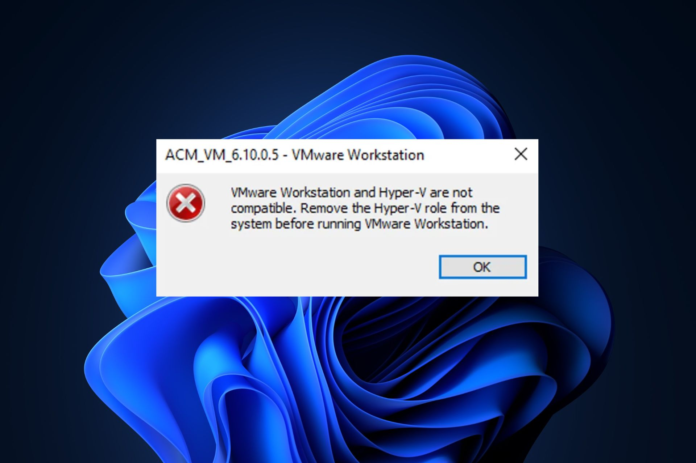
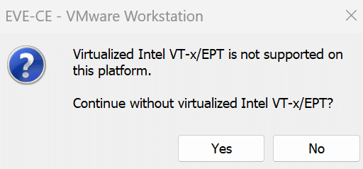

# ⚡ Guide technique d'activation totale de la virtualisation imbriquée sous Windows

<p align="center">
  
  
  
  
  
</p>

---

## Présentation du Projet

Lors de la mise en place d'environnements de simulation et de virtualisation avancée (tels que **VMware Workstation**, **Oracle VirtualBox**, **EVE-NG**, **GNS3**, ou **Proxmox VE**) sous **Windows 10 / 11**, de nombreux utilisateurs se heurtent à des blocages matériels et des conflits d'hyperviseur.

Par défaut, Windows active plusieurs mécanismes de sécurité basés sur la virtualisation (**VBS - Virtualization-Based Security**), l'intégrité de la mémoire (**HVCI**), **Credential Guard**, ainsi que la couche **Hyper-V**. Ces fonctionnalités verrouillent les extensions de virtualisation matérielle du processeur (**Intel VT-x** ou **AMD-V / SVM**), empêchant les hyperviseurs tiers de type 2 d'accéder directement au CPU et bloquant la **virtualisation imbriquée (*nested virtualization*)**.

Ce dépôt propose une documentation technique claire et structurée ainsi que des scripts PowerShell prêts à l'emploi pour :
1. **Débrider l'accès CPU** en désactivant proprement VBS, HVCI et Hyper-V.
2. **Activer la virtualisation imbriquée** pour faire tourner des routeurs, commutateurs et VM 64 bits dans vos labs.
3. **Restaurer l'état de sécurité initial** en un clic grâce à un script de *rollback*.

---

## Public Cible & Cas d'Usage

- **Étudiants en réseaux & télécoms** : réalisation de maquettes de topologie sous EVE-NG, GNS3, Cisco CML, etc.
- **Administrateurs Systèmes & Réseaux** : déploiement de clusters de test Proxmox, VMware ESXi virtuels, labs Active Directory / Linux.
- **Ingénieurs DevOps & Cybersécurité** : création d'environnements de test isolés avec accélération CPU hardware.
- **Tout utilisateur sous Windows** (équipé d'un processeur Intel ou AMD) souhaitant faire de la virtualisation sans conflit logiciel.

---

## Problèmes Rencontrés & Symptômes Visuels

Lorsque VBS ou Hyper-V est actif, des messages d'incompatibilité et des blocages surviennent au lancement de vos machines virtuelles :

<div align="center">
  <table>
    <tr>
      <th width="50%" align="center"><b>1. Conflit VMware Workstation & Hyper-V / Device Guard</b></th>
      <th width="50%" align="center"><b>2. Blocage VBS & Virtualisation Imbriquée</b></th>
    </tr>
    <tr>
      <td></td>
      <td></td>
    </tr>
    <tr>
      <td><i>Message typique : « VMware Workstation and Device/Credential Guard are not compatible ».</i></td>
      <td><i>Impossibilité de démarrer des VM 64-bit ou d'activer VT-x/AMD-V au sein d'EVE-NG ou Proxmox.</i></td>
    </tr>
  </table>
</div>

### Symptômes fréquents :
- **VMware Workstation** refuse d'exécuter la VM : *"Device Guard / Credential Guard is not compatible"*.
- **EVE-NG / GNS3** : les nœuds QEMU / KVM (routeurs Cisco IOL/Dynamips, appliances Fortinet, MikroTik, Linux) ne démarrent pas ou s'exécutent en émulation logicielle très lente.
- **VirtualBox** : affichage de l'icône de la tortue verte dans la barre d'état (mode dégradé via l'API Hyper-V) et impossibilité d'allouer plusieurs vCPU correctement.
- L'option *"Virtualize Intel VT-x/EPT or AMD-V/RVI"* reste grisée ou provoque un échec au démarrage de la machine hôte virtuelle.

---

## Table des Matières

- [⚡ Guide technique d'activation totale de la virtualisation imbriquée sous Windows](#-guide-technique-dactivation-totale-de-la-virtualisation-imbriquée-sous-windows)
  - [Présentation du Projet](#présentation-du-projet)
  - [Public Cible \& Cas d'Usage](#public-cible--cas-dusage)
  - [Problèmes Rencontrés \& Symptômes Visuels](#problèmes-rencontrés--symptômes-visuels)
    - [Symptômes fréquents :](#symptômes-fréquents-)
  - [Table des Matières](#table-des-matières)
  - [Prérequis](#prérequis)
  - [Méthode 1 : Automatisation via scripts PowerShell](#méthode-1--automatisation-via-scripts-powershell)
    - [1. Script d'activation](#1-script-dactivation)
    - [2. Script de restauration (rollback)](#2-script-de-restauration-rollback)
  - [Méthode 2 : Procédure manuelle](#méthode-2--procédure-manuelle)
    - [Étape 1 : Nettoyage et configuration du registre Windows](#étape-1--nettoyage-et-configuration-du-registre-windows)
    - [Étape 2 : Désactivation des fonctionnalités d'hyperviseur Windows](#étape-2--désactivation-des-fonctionnalités-dhyperviseur-windows)
    - [Étape 3 : Désactivation de l'Isolation du Noyau (HVCI)](#étape-3--désactivation-de-lisolation-du-noyau-hvci)
    - [Étape 4 : Redémarrage et vérification avec msinfo32](#étape-4--redémarrage-et-vérification-avec-msinfo32)
    - [Étape 5 : Configuration dans VMware Workstation \& VirtualBox](#étape-5--configuration-dans-vmware-workstation--virtualbox)
      - [🔹 VMware Workstation (EVE-NG, GNS3, Proxmox VE) :](#-vmware-workstation-eve-ng-gns3-proxmox-ve-)
      - [🔹 Oracle VirtualBox :](#-oracle-virtualbox-)
  - [Code source des scripts pour copier-coller rapide](#code-source-des-scripts-pour-copier-coller-rapide)
  - [FAQ \& Dépannage](#faq--dépannage)
  - [Sécurité \& Bonnes Pratiques](#sécurité--bonnes-pratiques)
  - [Licence \& Auteur](#licence--auteur)

---

## Prérequis

Avant de lancer les scripts ou la procédure manuelle :
1. **Virtualisation matérielle activée dans le BIOS / UEFI** :
   - **Intel** : Activez `Intel Virtualization Technology` (`Intel VT-x`) et `Intel VT-d`.
   - **AMD** : Activez `SVM Mode` (`Secure Virtual Machine`) ou `AMD-V`.
2. **Système d'exploitation** : Windows 10 ou Windows 11 (64 bits - Éditions Famille, Pro ou Entreprise).
3. **Privilèges** : Exécution requise avec les droits **Administrateur**.

---

## Méthode 1 : Automatisation via scripts PowerShell

Deux scripts PowerShell prêts à l'emploi sont disponibles dans le dossier [`Scripts/`](Scripts/) :

| Script | Fichier Source | Description |
| :--- | :--- | :--- |
| **Activation** | [`Scripts/activation.ps1`](Scripts/activation.ps1) | Désactive VBS, Credential Guard, HVCI et Hyper-V pour débrider les extensions CPU. |
| **Rollback** | [`Scripts/rollback.ps1`](Scripts/rollback.ps1) | Rétablit les configurations par défaut et réactive la sécurité Windows d'origine. |

### 1. Script d'activation

1. Ouvrez une console **PowerShell en tant qu'Administrateur** (*Clic droit sur le menu Démarrer > Terminal Windows (Administrateur) ou PowerShell (Admin)*).
2. Si la stratégie d'exécution bloque les scripts locaux, débloquez la session avec :
   ```powershell
   Set-ExecutionPolicy -Scope Process -ExecutionPolicy Bypass -Force
   ```
3. Exécutez le script d'activation :
   ```powershell
   .\Scripts\activation.ps1
   ```
4. Confirmez le redémarrage proposé ou redémarrez votre PC manuellement pour appliquer les modifications au niveau matériel.

---

### 2. Script de restauration (rollback)

Pour réactiver les composants de sécurité Windows ou réutiliser WSL2 / Windows Sandbox :
1. Ouvrez une console **PowerShell en tant qu'Administrateur**.
2. Exécutez le script de restauration :
   ```powershell
   .\Scripts\rollback.ps1
   ```
3. Redémarrez l'ordinateur pour réactiver l'intégrité de la mémoire et les modules Hyper-V.

---

## Méthode 2 : Procédure manuelle

Si vous préférez exécuter les manipulations manuellement pour comprendre chaque étape :

### Étape 1 : Nettoyage et configuration du registre Windows

1. Appuyez sur `Windows + R`, tapez `regedit` et validez par `Entrée`.
2. Rendez-vous au chemin suivant :
   ```text
   HKEY_LOCAL_MACHINE\SYSTEM\CurrentControlSet\Control\DeviceGuard
   ```
3. **Nettoyage optionnel** : si une entrée orpheline nommée `Nouvelle Valeur #1` existe, supprimez-la.
4. **Désactivation de VBS** :
   - Mettez la valeur DWORD 32 bits de `EnableVirtualizationBasedSecurity` sur `0`.
   - Si `EnableVirtualizationBasedSecurity` n'est pas présent, créez-le en cliquant sur `Nouveau > Valeur DWORD 32 bits`. Renommez-le exactement comme indiqué dans la parenthese (`EnableVirtualizationBasedSecurity`) et mettez la valeur à `0`

5. **Désactivation de Credential Guard** :
   - Rendez-vous dans `HKEY_LOCAL_MACHINE\SYSTEM\CurrentControlSet\Control\Lsa`.
   - Réglez la valeur DWORD `LsaCfgFlags` sur `0`.
6. **Désactivation de l'isolation du noyau (HVCI)** :
   - Rendez-vous dans `HKEY_LOCAL_MACHINE\SYSTEM\CurrentControlSet\Control\DeviceGuard\Scenarios\HypervisorEnforcedCodeIntegrity`.
   - Réglez la valeur DWORD `Enabled` sur `0`.

---

### Étape 2 : Désactivation des fonctionnalités d'hyperviseur Windows

L'hyperviseur natif Microsoft Hyper-V ne doit pas se charger au démarrage pour libérer le contrôle exclusif du processeur :

1. Appuyez sur `Windows + R`, tapez `optionalfeatures.exe` et validez par `Entrée`.
2. Décochez impérativement les cases suivantes :
   - **Hyper-V**
   - **Plateforme de l'hyperviseur Windows**
   - **Plateforme de machine virtuelle**
   - **Bac à sable Windows** (*si activé*)
3. Cliquez sur **OK** et laissez Windows désactiver les composants.

> [!TIP]
> **Alternative en ligne de commande PowerShell (en mode admin) :**
> ```powershell
> Dism /online /Disable-Feature /FeatureName:Microsoft-Hyper-V /NoRestart
> Dism /online /Disable-Feature /FeatureName:HyperVPlatform /NoRestart
> Dism /online /Disable-Feature /FeatureName:VirtualMachinePlatform /NoRestart
> ```

---

### Étape 3 : Désactivation de l'Isolation du Noyau (HVCI)

1. Ouvrez les **Paramètres Windows** (`Windows + I`) > **Confidentialité et sécurité** > **Sécurité Windows**.
2. Cliquez sur **Sécurité des appareils**, puis sur **Détails de l'isolement du noyau**.
3. Positionnez l'interrupteur **Intégrité de la mémoire** sur **Désactivé**.

---

### Étape 4 : Redémarrage et vérification avec msinfo32

1. **Redémarrez complètement votre ordinateur**.
2. Après l'ouverture de session, appuyez sur `Windows + R`, tapez `msinfo32` et validez.
3. Sur la page **Résumé système**, faites défiler vers le bas du panneau de droite.
4. Assurez-vous que la ligne **Sécurité basée sur la virtualisation** affiche : `Non activé` ou `Désactivée`.

---

### Étape 5 : Configuration dans VMware Workstation & VirtualBox

Une fois le système d'exploitation débridé, configurez vos hyperviseurs virtuels :

#### 🔹 VMware Workstation (EVE-NG, GNS3, Proxmox VE) :
1. Faites un clic droit sur la machine virtuelle > **Settings** (*Paramètres*).
2. Dans l'onglet **Hardware**, cliquez sur **Processors**.
3. Cochez impérativement l'option :
   - ☑️ **Virtualize Intel VT-x/EPT or AMD-V/RVI**
   - ☑️ *(Optionnel)* **Virtualize CPU performance counters**
4. Validez par **OK** et démarrez la VM.

#### 🔹 Oracle VirtualBox :
1. Sélectionnez votre VM > **Configuration** > **Système** > onglet **Processeur**.
2. Cochez l'option : ☑️ **Activer la virtualisation imbriquée VT-x/AMD-V**.
3. Dans l'onglet **Accélération**, conservez l'interface de paravirtualisation sur **Par défaut** ou **KVM**.

---

## Code source des scripts pour copier-coller rapide

<details open>
<summary><b>1. Script d'Activation : <code>activation.ps1</code></b></summary>

```powershell
<#
.SYNOPSIS
Automatisation du débridage CPU pour les labs nécessitant de la virtualisation imbriquée.

.DESCRIPTION
Ce script désactive proprement la sécurité basée sur la virtualisation (VBS),
Credential Guard, l'isolation du noyau (HVCI), ainsi que l'hyperviseur natif
Hyper-V pour libérer les extensions Intel VT-x / AMD-V au profit de VMware Workstation.

.NOTES
Exécution obligatoire en tant qu'Administrateur. Un redémarrage est requis après exécution.
#>

# 1. ÉLÉVATION DES PRIVILÈGES
$isAdmin = ([Security.Principal.WindowsPrincipal][Security.Principal.WindowsIdentity]::GetCurrent()).IsInRole(
    [Security.Principal.WindowsBuiltInRole]::Administrator
)

if (-not $isAdmin) {
    Write-Error "Ce script doit impérativement être exécuté dans une console PowerShell en tant qu'ADMINISTRATEUR."
    Exit
}

Write-Host "=== Début de la configuration du système pour le Lab VMware (Proxmox / EVE-NG) ===" -ForegroundColor Cyan

# 2. CONFIGURATION DU REGISTRE WINDOWS (DÉSACTIVATION DE VBS & VARIANTES)
$RegistryPathDeviceGuard = "HKLM:\SYSTEM\CurrentControlSet\Control\DeviceGuard"
$RegistryPathLsa = "HKLM:\SYSTEM\CurrentControlSet\Control\Lsa"
$RegistryPathHvci = "HKLM:\SYSTEM\CurrentControlSet\Control\DeviceGuard\Scenarios\HypervisorEnforcedCodeIntegrity"

Write-Host "`n[1/3] Modification des clés de Registre..." -ForegroundColor Yellow

# Nettoyage d'un éventuel registre orphelin (s'il existe)
if (Get-ItemProperty -Path $RegistryPathDeviceGuard -Name "Nouvelle Valeur #1" -ErrorAction SilentlyContinue) {
    Remove-ItemProperty -Path $RegistryPathDeviceGuard -Name "Nouvelle Valeur #1" -Force
    Write-Host "  -> Clé résiduelle 'Nouvelle Valeur #1' détectée et supprimée." -ForegroundColor Gray
}

# Gestion et désactivation des deux variantes de clés VBS connues
if (-not (Test-Path $RegistryPathDeviceGuard)) {
    New-Item -Path $RegistryPathDeviceGuard -Force | Out-Null
}

New-ItemProperty -Path $RegistryPathDeviceGuard -Name "EnableVirtualizationBasedSecurity" -Value 0 -PropertyType DWORD -Force | Out-Null
New-ItemProperty -Path $RegistryPathDeviceGuard -Name "EnabledVirtualizationSecurityBased" -Value 0 -PropertyType DWORD -Force | Out-Null
Write-Host "  -> Les commutateurs globaux VBS (variantes incluses) ont été positionnés à 0." -ForegroundColor Green

# Désactivation des indicateurs de politique Credential Guard (LsaCfgFlags à 0)
New-ItemProperty -Path $RegistryPathLsa -Name "LsaCfgFlags" -Value 0 -PropertyType DWORD -Force | Out-Null
Write-Host "  -> Configuration Credential Guard (LsaCfgFlags) positionnée à 0." -ForegroundColor Green

# Désactivation de l'intégrité de la mémoire (HVCI / Isolation du noyau)
if (-not (Test-Path $RegistryPathHvci)) {
    New-Item -Path $RegistryPathHvci -Force | Out-Null
}

New-ItemProperty -Path $RegistryPathHvci -Name "Enabled" -Value 0 -PropertyType DWORD -Force | Out-Null
Write-Host "  -> Isolation du noyau / Intégrité de la mémoire configurée sur Désactivé (0)." -ForegroundColor Green

# 3. DÉSACTIVATION DES COMPOSANTS HYPER-V
Write-Host "`n[2/3] Désactivation des fonctionnalités et hyperviseurs Windows conflictuels..." -ForegroundColor Yellow

$FeaturesToDisable = @("Microsoft-Hyper-V", "HyperVPlatform", "VirtualMachinePlatform")
foreach ($Feature in $FeaturesToDisable) {
    Write-Host "  -> Vérification et suppression du composant : $Feature..." -ForegroundColor Gray
    Dism /online /Disable-Feature /FeatureName:$Feature /NoRestart | Out-Null
}

Write-Host "  -> Fonctionnalités Windows d'hyperviseur désactivées." -ForegroundColor Green

# 4. FINALISATION ET DEMANDE DE REDÉMARRAGE
Write-Host "`n[3/3] Configuration terminée avec succès !" -ForegroundColor Cyan
Write-Host "----------------------------------------------------------------------"
Write-Host "IMPORTANT : Un redémarrage complet est requis pour libérer le processeur."
Write-Host "----------------------------------------------------------------------"

$Reboot = Read-Host "Voulez-vous redémarrer votre ordinateur immédiatement ? (O/N)"
if ($Reboot -eq "O" -or $Reboot -eq "o") {
    Write-Host "Redémarrage du système en cours..." -ForegroundColor Magenta
    Restart-Computer -Force
}
else {
    Write-Host "Pensez à redémarrer manuellement avant de lancer VMware Workstation." -ForegroundColor Yellow
}
```

</details>

<details>
<summary><b>2. Script de Restauration : <code>rollback.ps1</code></b></summary>

```powershell
<#
.SYNOPSIS
Script de Rollback : Restauration des paramètres de sécurité d'origine.

.DESCRIPTION
Ce script annule toutes les modifications précédentes en réactivant VBS,
Credential Guard, l'isolation du noyau (HVCI) et les fonctionnalités Hyper-V natives.

.NOTES
Exécution obligatoire en tant qu'Administrateur. Un redémarrage est requis après exécution.
#>

# 1. ÉLÉVATION DES PRIVILÈGES
$isAdmin = ([Security.Principal.WindowsPrincipal][Security.Principal.WindowsIdentity]::GetCurrent()).IsInRole(
    [Security.Principal.WindowsBuiltInRole]::Administrator
)

if (-not $isAdmin) {
    Write-Error "Ce script doit impérativement être exécuté dans une console PowerShell en tant qu'ADMINISTRATEUR."
    Exit
}

Write-Host "=== Restauration des paramètres de sécurité et d'hyperviseur d'origine ===" -ForegroundColor Cyan

# 2. RESTAURATION DU REGISTRE WINDOWS (RÉACTIVATION DE VBS & CREDENTIAL GUARD)
$RegistryPathDeviceGuard = "HKLM:\SYSTEM\CurrentControlSet\Control\DeviceGuard"
$RegistryPathLsa = "HKLM:\SYSTEM\CurrentControlSet\Control\Lsa"
$RegistryPathHvci = "HKLM:\SYSTEM\CurrentControlSet\Control\DeviceGuard\Scenarios\HypervisorEnforcedCodeIntegrity"

Write-Host "`n[1/3] Restauration des clés de Registre..." -ForegroundColor Yellow

# Réactivation des commutateurs globaux VBS à 1 (Activé par défaut sous Windows 11)
if (Test-Path $RegistryPathDeviceGuard) {
    New-ItemProperty -Path $RegistryPathDeviceGuard -Name "EnableVirtualizationBasedSecurity" -Value 1 -PropertyType DWORD -Force | Out-Null
    New-ItemProperty -Path $RegistryPathDeviceGuard -Name "EnabledVirtualizationSecurityBased" -Value 1 -PropertyType DWORD -Force | Out-Null
    Write-Host "  -> Commutateurs globaux VBS réactivés (1)." -ForegroundColor Green
}

# Réactivation de la politique Credential Guard (LsaCfgFlags à 1)
if (Test-Path $RegistryPathLsa) {
    New-ItemProperty -Path $RegistryPathLsa -Name "LsaCfgFlags" -Value 1 -PropertyType DWORD -Force | Out-Null
    Write-Host "  -> Configuration Credential Guard (LsaCfgFlags) réactivée (1)." -ForegroundColor Green
}

# Réactivation de l'intégrité de la mémoire (HVCI / Isolation du noyau)
if (Test-Path $RegistryPathHvci) {
    New-ItemProperty -Path $RegistryPathHvci -Name "Enabled" -Value 1 -PropertyType DWORD -Force | Out-Null
    Write-Host "  -> Isolation du noyau / Intégrité de la mémoire réactivée (1)." -ForegroundColor Green
}

# 3. RÉACTIVATION DES COMPOSANTS HYPER-V (PLATEFORME DE MICROSOFT)
Write-Host "`n[2/3] Réactivation des fonctionnalités d'hyperviseur Windows..." -ForegroundColor Yellow

# Liste des modules Windows à réinstaller pour restaurer l'état d'origine
$FeaturesToEnable = @(
    "VirtualMachinePlatform",
    "HyperVPlatform",
    "Microsoft-Hyper-V"
)

foreach ($Feature in $FeaturesToEnable) {
    Write-Host "  -> Installation du composant : $Feature..." -ForegroundColor Gray
    Dism /online /Enable-Feature /FeatureName:$Feature /NoRestart | Out-Null
}

Write-Host "  -> Fonctionnalités Windows d'hyperviseur réinstallées." -ForegroundColor Green

# 4. FINALISATION ET DEMANDE DE REDÉMARRAGE
Write-Host "`n[3/3] Restauration terminée avec succès !" -ForegroundColor Cyan
Write-Host "----------------------------------------------------------------------"
Write-Host "IMPORTANT : Un redémarrage complet est requis pour appliquer la sécurité."
Write-Host "Note : Après le reboot, la virtualisation imbriquée dans VMware sera bridée."
Write-Host "----------------------------------------------------------------------"

$Reboot = Read-Host "Voulez-vous redémarrer votre ordinateur immédiatement ? (O/N)"
if ($Reboot -eq "O" -or $Reboot -eq "o") {
    Write-Host "Redémarrage du système en cours..." -ForegroundColor Magenta
    Restart-Computer -Force
}
else {
    Write-Host "Pensez à redémarrer manuellement pour appliquer le retour à la normale." -ForegroundColor Yellow
}
```

</details>

---

## FAQ & Dépannage

> [!NOTE]
> **Q : Le message d'erreur persiste malgré l'exécution du script et le redémarrage.**  
> **R :** Assurez-vous que le lancement automatique de l'hyperviseur Windows au démarrage (`BCD`) est désactivé. Exécutez dans une invite de commande Administrateur :
> ```cmd
> bcdedit /set hypervisorlaunchtype off
> ```
> Puis effectuez un nouveau redémarrage.

> [!NOTE]
> **Q : Cette procédure fonctionne-t-elle sur les processeurs Intel et AMD ?**  
> **R :** Oui, la méthode débloque les extensions matérielles **Intel VT-x / EPT** et **AMD-V / SVM / RVI** de manière identique.

> [!NOTE]
> **Q : Puis-je réactiver WSL2 (Windows Subsystem for Linux) plus tard ?**  
> **R :** Oui. Pour réutiliser WSL2 ou Windows Sandbox, exécutez simplement `.\Scripts\rollback.ps1` et redémarrez votre poste. Vous pouvez également exécuter vos distributions Linux directement dans VMware Workstation ou VirtualBox.

---

## Sécurité & Bonnes Pratiques

> [!IMPORTANT]
> Les mécanismes VBS, HVCI (Intégrité de la mémoire) et Credential Guard sont conçus pour protéger le système contre les attaques avancées ciblant la mémoire du noyau.
> 
> La désactivation de ces module est déconseillée en environnement de production et sur des postes comportant sensibles. Il est fortement recommandé d'utiliser le script `rollback.ps1` pour réactiver les protections une fois vos sessions de lab terminées.

---

## Licence & Auteur

Ce projet est distribué sous la licence **MIT**. Consultez le fichier [`LICENSE`](LICENSE) pour plus d'informations.

- **Auteur :** [Nelson Bandos](https://www.linkedin.com/in/nelson-bandos)
- **Domaine :** Réseaux, Sécurité & Virtualisation

<div align="center">
© 2026 Nelson Bandos
</div>